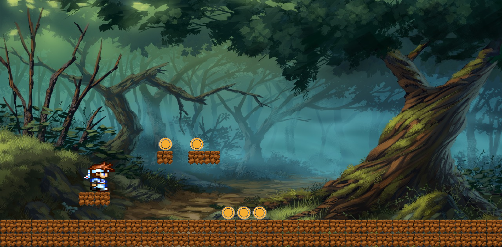

# WebGL engine

A little webgl experiment. Features batched sprite rendering sprite animation and collision detection.

## Build

Run the following command from the terminal:

`$> tsc --build tsconfig.json`

## Running locally

- install a http server `npm install --global http-server`
- run `npm install` from the root folder
- `$> tsc --build tsconfig.json`
- run `http-server command` from the root folder

